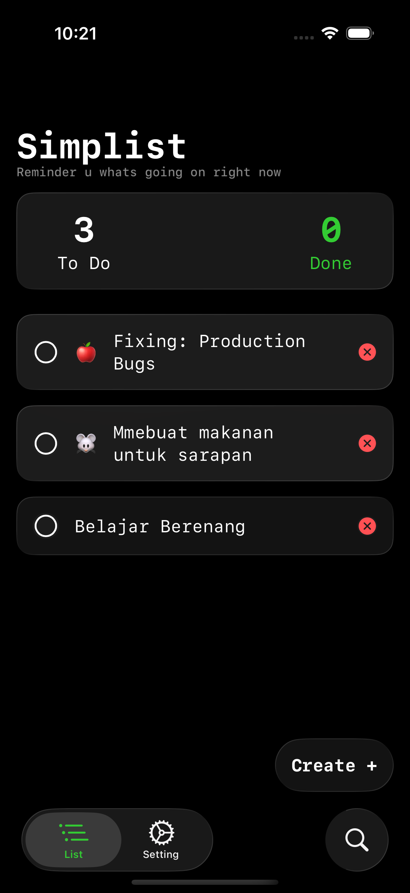
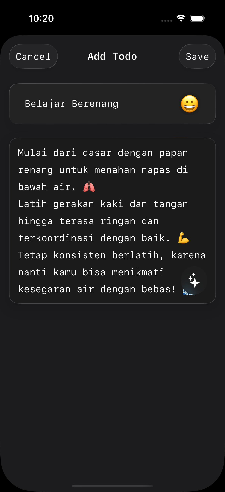

# Simplist - A Simple Todo App

A simple and beautiful Todo application for iOS, built with SwiftUI. It allows users to manage their tasks, and includes features like link previews and a "terminal green" theme.

## Screenshots

| Homescreen | Add Todo Screen |
| :---: | :---: |
|  |  |

## Features

- **Todo Management**: Create, edit, and delete todos with a simple and intuitive interface.
- **Swipe to Delete**: Easily delete todos with a swipe gesture.
- **AI-Powered Descriptions**: Automatically generate descriptions for your todos using an AI service.
- **Link Management**: A dedicated section to save, preview, edit, and delete URLs.
- **Customizable Appearance**: Includes an emoji picker for todos and a "terminal green" theme.
- **Rich Link Previews**: Automatic and beautiful link previews for saved URLs.
- **Search**: Quickly find your todos.
- **Summary View**: A dashboard showing the count of completed and pending todos.

## Project Structure

The project is organized into the following main directories under `TodoApp/`:

-   **Presentation**: Contains all the SwiftUI views, organized by feature (Todos, Links, Settings). Reusable form components and sheets are also located here.
-   **DesignSystem**: Holds reusable UI components and styles, like the `glassEffect`.
-   **Services**: Contains services for interacting with external APIs, like `HgFaceService.swift`.
-   **Data Models**: The SwiftData models (`TodoStore.swift`, `LinkStore.swift`) are located alongside the views that use them.

## Technologies Used

-   **UI**: SwiftUI
-   **Data Persistence**: SwiftData
-   **External APIs**:
    -   Hugging Face API for AI-powered text generation.
-   **Apple Frameworks**:
    -   LinkPresentation for rich URL previews.
    -   SafariServices for in-app browsing.

## How to Run

1.  **Clone the repository.**
2.  **Set up the API Key**: Open the project in Xcode and navigate to `TodoApp/Services/HgFaceService.swift`. Replace the placeholder `YOUR_HUGGING_FACE_API_KEY` with your actual Hugging Face API key.
3.  **Open in Xcode**: Open the `.xcodeproj` file.
4.  **Run the app**: Select a simulator or a physical device and run the project.